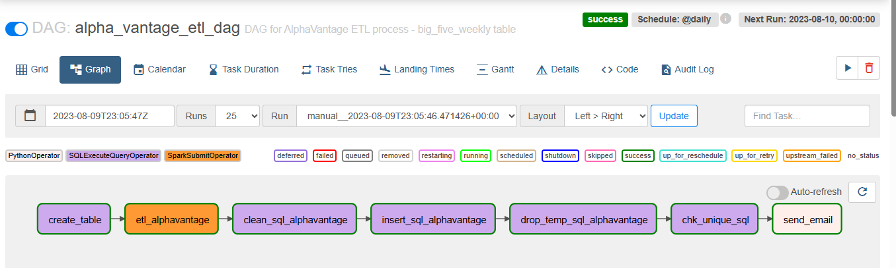

# Coderhouse Data Engineering Final Project

Welcome to the Coderhouse Data Engineering Final Project repository! Here, I present an ETL endeavor that acquires financial market data from a JSON API, refines it with Apache Spark, and loads the processed information into an Amazon Redshift table. Apache Airflow skillfully orchestrates this workflow, ensuring efficient task execution and sending data insights via email through the SMTP service.

## Project Description

The main components of this project include:

- **Extraction**: Data is fetched from the financial market using the AlphaVantage API.
- **Transformation**: The retrieved JSON data is processed using Apache Spark, ensuring its quality and format.
- **Loading**: Processed data is loaded into a table on Amazon Redshift for further analysis.

## Getting API Key

To execute the ETL process, you'll need an API key from AlphaVantage. You can obtain a demo API key by visiting [this link](https://www.alphavantage.co/support/#api-key).

## Project Structure

The repository includes the following files and directories:

- `docker_images/`: Contains Dockerfiles to build Airflow and Spark images.
- `docker-compose.yml`: Docker Compose configuration file, containing settings for Airflow and Spark services.
- `.env`: Environment variables file, containing connection variables for Redshift, the Postgres driver and api_key.
- `dags/`: Directory containing DAG (Directed Acyclic Graph) files.
  - `etl_alphavantage.py`: Main DAG file executing the user data extraction, transformation, and loading pipeline.
- `scripts/`: Directory with Spark scripts.
  - `postgresql-42.5.2.jar`: Postgres driver for Spark.
  - `commons.py`: Common Spark script with utility functions.
  - `etl_alphavantage.py`: Spark script for executing the ETL process.

## Setup and Usage Instructions

Follow these steps to set up and use the repository and its components. These instructions will guide you through cloning the repository, building Docker images, and configuring environment variables.

### 1. Clone the Repository

To begin, clone the repository using the following command:

```bash
git clone https://github.com/LaureanoEngulian/EntregaFinal_LaureanoEngulian_DATAENG_51940.git
```

### 2. Build Airflow Docker Image
Navigate to the docker_images/airflow directory and execute the following command to build the Airflow Docker image:

```bash
docker build -t laureanoengulian/airflow:airflow_2_6_2 .
```

### 3. Build Spark Docker Image
Next, go to the docker_images/spark directory and run the following command to build the Spark Docker image:

```bash
docker build -t laureanoengulian/spark:spark_version .
```

### 4. Configure the .env File
In the root directory of the repository (the same location as the `docker-compose.yml` file), create a file named .env and configure the following environment variables without values:

```
REDSHIFT_HOST=
REDSHIFT_PORT=
REDSHIFT_DB=
REDSHIFT_USER=
REDSHIFT_SCHEMA=
REDSHIFT_PASSWORD=
REDSHIFT_URL=jdbc:postgresql://${REDSHIFT_HOST}:${REDSHIFT_PORT}/${REDSHIFT_DB}?user=${REDSHIFT_USER}&password=${REDSHIFT_PASSWORD}
DRIVER_PATH=/tmp/drivers/postgresql-42.5.2.jar
API_KEY=
```
Make sure to fill in all the variables with the correct information before using the repository.

### 5. Running the Services

Execute the following command to start the Airflow and Spark services from the directory containing the `docker-compose.yml`:

```bash
docker-compose up --build
```

### 6. Accessing Airflow
Once the services are up, access Airflow at http://localhost:8080/.

### 7. Creating a Redshift Connection
In the Admin -> Connections tab, create a new connection with the following details for Redshift:

```
Conn Id: redshift_default
Conn Type: Amazon Redshift
Host: redshift host
Database: redshift database
Schema: redshift schema
User: redshift user
Password: redshift password
Port: 5439
```

### 10. Creating a Spark Connection
In the Admin -> Connections tab, create a new connection with the following details for Spark:

```
Conn Id: spark_default
Conn Type: Spark
Host: spark://spark
Port: 7077
Extra: {"queue": "default"}
```

### 11. Creating Airflow Variables
In the Admin -> Variables tab, create a new variable with the following details:

```
Key: driver_class_path
Value: /tmp/drivers/postgresql-42.5.2.jar
```

### 12. Creating Spark Scripts Directory Variable
In the Admin -> Variables tab, create another variable with the following details:

```
Key: spark_scripts_dir
Value: /opt/airflow/scripts
```
### 12. Creating SMTP Variables
In the Admin -> Variables tab, create SMTP variables with the following details:

```
Key: sender_email 
Key: sender_password
Key: recipient_email
```
#### Access token for sending emails  ([Instructions](https://support.google.com/accounts/answer/185833?hl=es-419))


### 13. Run alpha_vantage_etl_dag DAG
Trigger `alpha_vantage_etl_dag`. 

- `create_table`: Creates big_five_weekly in Redshift
- `etl_alphavantage`: Runs ETL
- `clean_sql_alphavantage`: Clean duplicates in temp table
- `insert_sql_alphavantage`: Insert values in big_five_weekly
- `drop_temp_sql_alphavantage`: Drop temp table
- `chk_unique_sql`: Query big_five_weekly to verify duplicates
- `send_email_task`: Sends a status email if the process ran correctly or not (Verifying duplicates in the table)




#### For any questions or issues, please contact [laureanoengulian@gmail.com](mailto:laureanoengulian@gmail.com).
